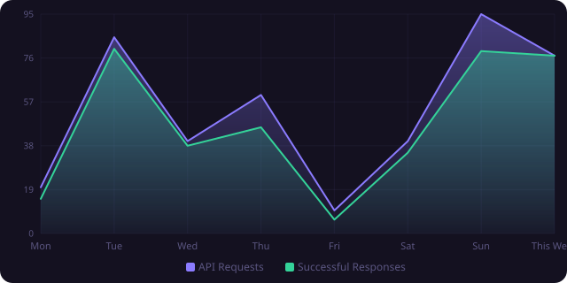
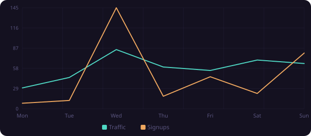
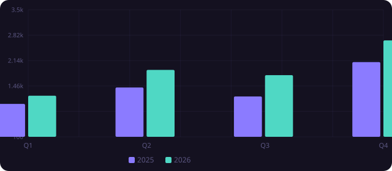
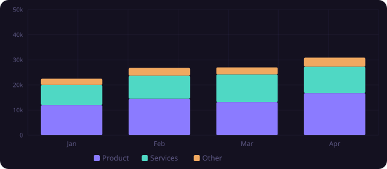
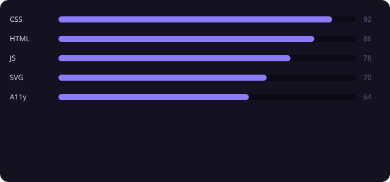
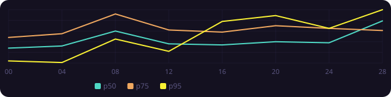
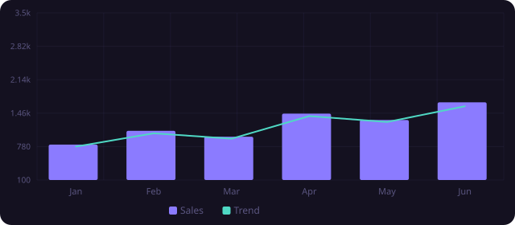

# ProvChart charts (sample)

Example repo for the [ProvChart README Action](https://github.com/fscss-ttr/provchart-readme-action).

Fork → add secret `PROVCHART_API_KEY` → run **Actions** → SVGs refresh under `docs/charts/`.

Config: [`.provchart/charts.json`](./.provchart/charts.json)

---

## API week

## Traffic

## Quarterly sales

## Revenue mix

## Skills

## Latency

## Sales + trend

## Health

## Disk

---

## Setup

1. Create a key at [chart.devtem.org/dashboard](https://chart.devtem.org/dashboard)
2. Repo **Settings → Secrets → Actions** → `PROVCHART_API_KEY`
3. **Actions** → run the charts workflow (or push a change under `.provchart/`)

## Stack

| Piece | Link |
|--------|------|
| Action | [fscss-ttr/provchart-readme-action](https://github.com/fscss-ttr/provchart-readme-action) |
| Product | [chart.devtem.org](https://chart.devtem.org) |
| Guide | [Charts in Markdown](https://chart.devtem.org/guides/charts-in-markdown) |

MIT samples · charts generated via ProvChart SVG API
